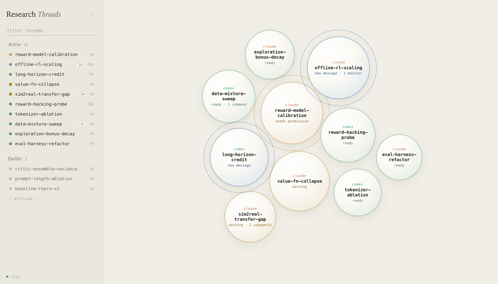

# Research Threads

A local dashboard for the research threads you choose to track. A thread is a
Claude Code or Codex session you told your agent to follow: from then on the
session is tracked automatically, keeps its full history after it closes, and
the agent maintains the thread's objective, current status, notes and plots.

It works from any terminal. Emacs is supported, and optional.



## The model

Threads are **explicitly started, automatically followed**:

```
you:    "track this as a research thread about value-function collapse"
agent:  rt start value-fn-collapse -o "Test whether the value fn explains collapse"
```

That one command registers the session as a thread. The server then follows it
on its own — open, working, waiting for your input, or closed — by watching
the process table and the state files the agents' hooks write. Ordinary coding
sessions are never tracked: no registration, no thread.

Each thread carries:

- **Objective** — one sentence stating the research question (`rt start -o` /
  `rt objective`).
- **Current status** — a living section the agent replaces with `rt update`
  after significant progress: where the investigation stands + outstanding
  TODOs. The `research-dashboard` skill makes agents keep this fresh.
- **Notes / plots / links** — an append-only timeline (`rt note`, `rt plot`,
  `rt link`), written by agents and by you.

## Quick start

```bash
./install.sh                       # see Install below for what it touches
cd ~/dev/my-project && claude      # or codex — any terminal
```

Then tell the agent: *"track this as a research thread about X"*. It runs
`rt start`, and the thread shows up at http://localhost:7878. You can do the
same by hand:

```bash
rt start value-fn-collapse -o "Test whether the value fn explains collapse"
rt note "lr=3e-4 diverges after 40k steps"
rt open                            # open the dashboard
```

No thread id is ever needed: `rt` finds the thread from the session it runs
in. For more precise tracking than the working directory alone can give, see
[Naming your sessions](#naming-your-sessions).

## Requirements

- **macOS** — session detection uses `ps` and `lsof`, and the server is
  started at login by launchd. It runs on Linux if you start it yourself,
  but that is untested.
- **Python 3** — stdlib only, nothing to install.
- **Claude Code and/or Codex** — the sessions being tracked.

Optional: **Emacs with [vterm](https://github.com/akermu/emacs-libvterm)**,
for the Emacs dashboard.

## Install / update

```bash
./install.sh          # idempotent; re-run after git pull
./install.sh --emacs  # also install the Emacs dashboard
./install.sh --no-emacs
./install.sh --uninstall
```

Installs `rt` into `~/.local/bin`, the `research-dashboard` skill for
whichever of Claude Code / Codex you have, status hooks in
`~/.claude/settings.json` and `~/.codex/hooks.json` (each backed up first;
Codex may ask to re-trust its hooks), and a launchd agent that starts the
server at login. The Emacs step runs only if `~/.emacs.d/init.el` exists or
you pass `--emacs`, and never with `--no-emacs`.

The server is self-managing (launchd at login; `rt`, Emacs and the skill start
it on demand), binds 127.0.0.1 only, and stores everything in
`~/.research-threads/` — SQLite plus copied plot files. Logs go to
`~/.research-threads/server.log`.

## The views

- **Web app** — http://localhost:7878 · ivory light theme. A collapsible left
  sidebar lists active threads and history; the center shows each active
  thread as a floating bubble — gently drifting, breathing while the agent
  works, rippling when it needs you. Click anything for the detail panel
  (objective, current status, notes, plots, pin/archive/rename). `/` filters;
  `#t<id>` deep-links.
- **`rt` CLI** — everything above, plus `rt threads`, `rt whoami`, `rt open`.
- **Emacs dashboard** *(optional)* — see below.

## Naming your sessions

By default a thread is tied to the directory the agent runs in. That is enough
to see which threads are open and which have closed, and the dashboard infers
*working* vs *ready* from CPU use. Two things stay out of reach: the exact
status the agent reports (**needs permission**, **needs attention**), and
posting from anywhere other than that exact directory — a subdirectory will
not match.

Both come free if you give the session a name before launching the agent:

```bash
CLAUDE_VTERM_NAME=value-fn-collapse claude
```

The hooks key their state files on that name and the server reads them, so
status becomes exact and `rt` finds the thread from any directory. The
variable is named for Emacs vterm, where it is set for you, but nothing about
it needs Emacs — a plain shell, a tmux pane or an iTerm tab all work. A shell
function is the easy way to make it habitual:

```bash
rtclaude() { CLAUDE_VTERM_NAME="$1" claude; }   # rtclaude value-fn-collapse
```

## Emacs (optional)

`./install.sh --emacs` adds the dashboard to your `init.el`, bound to `C-c r`
(or `M-x research-threads`). It names every vterm it launches, so threads
started there get exact status automatically.

`C-n` starts a new thread — it asks for a name, agent and directory, registers
the thread and opens a vterm running the agent. `RET` jumps to a thread's
vterm and offers to reopen closed ones, `c` adds a note, `o` opens the thread
on the web, `x` closes its vterm, `a`/`*` archive/pin (archiving offers to
kill the vterm), `A` shows the archived section, `g` refreshes. The buffer
auto-refreshes while visible.

With Emacs running a server, the web app's *open in emacs* button jumps
straight to a thread's vterm.

## Configuration

| Variable | Default | Meaning |
| --- | --- | --- |
| `RESEARCH_THREADS_PORT` | `7878` | port the server binds and `rt` talks to |
| `RESEARCH_THREADS_DATA` | `~/.research-threads` | database and copied plots |
| `RESEARCH_THREADS_USER` | your login name | how your own notes are signed |
| `RT_AUTHOR` | inferred | override the author `rt` posts as |
| `CLAUDE_VTERM_NAME` | unset | name of this session, for exact status |

## Layout

```
server.py                     zero-dependency server: tracking, SQLite, API, SSE
web/                          the web app (vanilla HTML/CSS/JS, no build step)
bin/rt                        CLI used by agents and humans
emacs/research-threads.el     the Emacs dashboard
skills/research-dashboard/    SKILL.md for Claude Code and Codex
hooks/vterm-state.sh          status hook the agents run (wired by install.sh)
launchd/                      launch-at-login plist template
install.sh                    idempotent installer / uninstaller
```

## API

```
GET  /api/state                     all threads with live status
GET  /api/threads/<id>              one thread: notes, sessions, status history
GET  /api/events                    SSE stream of state snapshots
POST /api/register                  {name, objective?, vterm?|cwd?}   (rt start)
POST /api/objective                 {text, vterm?|cwd?|thread_id?}
POST /api/status                    {text, vterm?|cwd?|thread_id?}    (rt update)
POST /api/notes                     {text, kind?, author?, vterm?|cwd?|thread_id?}
POST /api/plots                     {path, caption?, vterm?|cwd?|thread_id?}
POST /api/threads/<id>/<action>     archive|unarchive|pin|unpin|rename|focus
```

`focus` switches Emacs to the thread's vterm via `emacsclient` (the Emacs
dashboard enables `server-start` so this works).

## License

MIT — see [LICENSE](LICENSE).
